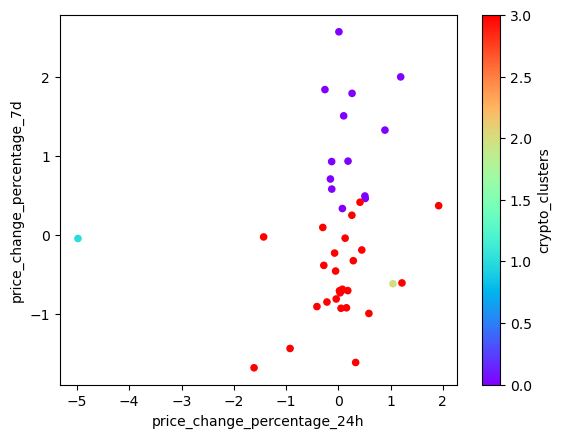
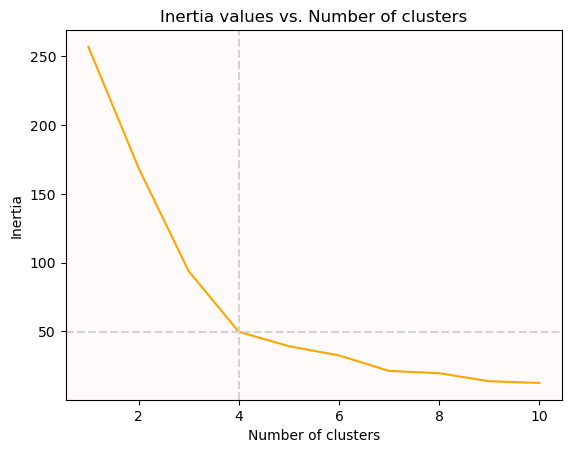
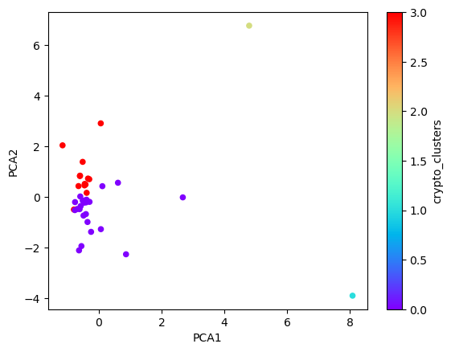
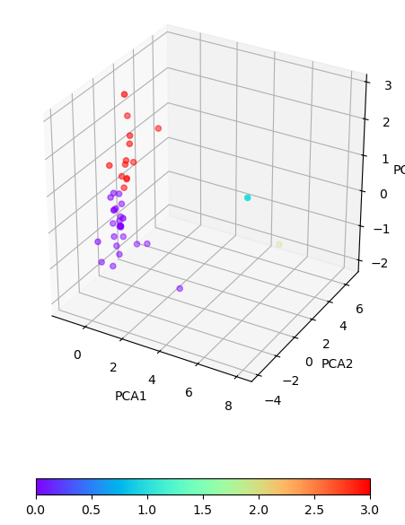

# Week_11_challenge

**In this project we examine how well the KMeans algorithim from Sklearn clusters data. After importing the necessary dependencies we perform a succint exploratory analysis:**

**Note: Abreviation to fit page price_change_percentage = ppc**

#### Data frame
       coin_id             ppc_24h     ppc_7d      ppc_14d     ppc_30d     ppc_60d     ppc_200d     ppc_1y    
     | bitcoin         |  1.08388  |  7.60278  |   6.57509 |   7.67258 |  -3.25185 |   83.5184  |  37.5176  |
     | ethereum        |  0.22392  | 10.3813   |   4.80849 |   0.13169 | -12.8889  |  186.774   | 101.96    |
     | tether          |  0.21173  |  0.04935  |   0.0064  |  -0.04237 |   0.28037 |  -0.00542  |   0.01954 |
     | ripple          |  -0.37819 | -0.60926  |   2.24984 |   0.23455 | -17.5525  |  39.5389   | -16.6019  |
     
#### Features statistical metrics
                  ppc_24h           ppc_7d          ppc_14d           ppc_30d        ppc_60d              ppc_200d        ppc_1y 
      count |      41        |      41       |      41        |       41       |     41         |         41      |      41       |
      mean  |      -0.269686 |       4.49715 |       0.185787 |        1.54569 |     -0.0941185 |        236.537  |     347.668   |
      std   |       2.69479  |       6.37522 |       8.37694  |       26.3442  |     47.3658    |        435.225  |    1247.84    |
      min   |     -13.5279   |      -6.09456 |     -18.1589   |      -34.7055  |    -44.8225    |         -0.3921 |     -17.5675  |
      25%   |      -0.60897  |       0.04726 |      -5.02662  |      -10.4385  |    -25.908     |         21.6604 |       0.40617 |
      50%   |      -0.06341  |       3.29641 |       0.10974  |       -0.04237 |     -7.54455   |         83.9052 |      69.692   |
      75%   |       0.61209  |       7.60278 |       5.51074  |        4.57813 |      0.65726   |        216.178  |     168.373   |
      max   |       4.84033  |      20.6946  |      24.2392   |      140.796   |    223.064     |       2227.93   |    7852.09    |

**Above the mean, standard deviation, count and other metrics for the data are displayed to obtain a sense of the feature range and behavior
afterwards the data is scaled to prevent the results to be skewed by one feature.**

#### Scaled data
       coin_id            ppc_24h      ppc_7d      ppc_14d      ppc_30d      ppc_60d       ppc_200d     ppc_1y
     | bitcoin      |    0.508529   |  0.493193  |  0.7722    |  0.23546   | -0.0674951  | -0.355953 |  -0.251637 |
     | ethereum     |    0.185446   |   0.934445 |  0.558692  | -0.0543409 | -0.273483   | -0.115759 |  -0.199352 |
     | tether       |    0.021774   |  -0.706337 | -0.0216804 | -0.0610302 |  0.00800452 | -0.550247 |  -0.282061 |
     | ripple       |   -0.0407644  |  -0.810928 |  0.249458  | -0.050388  | -0.373164   | -0.458259 |  -0.295546 | 
     | bitcoin-cash |     1.19304   |   2.00096  |  1.76061   |  0.545842  | -0.291203   | -0.499848 |  -0.270317 |

**To continue our analysis process we define a function dubbed best_k which takes in the scaled dataframe and returns another 
with the inertia values for each number of clusters examnied, which are plotted to determin the appropiate number of clusters**

#### Inertia values data frame
       K        Inertia 
       1     |    287    
       2     |    198.57 
       3     |    123.19 
       4     |     79.02 
       5     |     68.24 
       

#### Elbow curve visualization

**After looking at the graph the number of clusters selected is 4 because at this value the graphs demonstrates the sharpest change in 
slope. With the number of clusters selected the KMeans algorithm is instantiated and fitted to late perform predictions.**

#### Predicted cluster data frame

       coin_id            ppc_24h      ppc_7d       ppc_14d      ppc_30d      ppc_60d       ppc_200d      ppc_1y  |   crypto_clusters |
     | bitcoin      |    0.508529   |  0.493193  |  0.7722    |  0.23546   | -0.0674951  | -0.355953 |  -0.251637 |       0           |
     | ethereum     |    0.185446   |   0.934445 |  0.558692  | -0.0543409 | -0.273483   | -0.115759 |  -0.199352 |       0           |
     | tether       |    0.021774   |  -0.706337 | -0.0216804 | -0.0610302 |  0.00800452 | -0.550247 |  -0.282061 |       3           |
     | ripple       |   -0.0407644  |  -0.810928 |  0.249458  | -0.050388  | -0.373164   | -0.458259 |  -0.295546 |       3           |
     | bitcoin-cash |     1.19304   |   2.00096  |  1.76061   |  0.545842  | -0.291203   | -0.499848 |  -0.270317 |       0           |

#### Cluster scatter plot

#### Principal Component Analysis (PCA)

**In this section we perform PCA on the data and examine the results,as per the instructions the number of n_components was set to 3
and the totla explained variance was approximately 90% which for our intents and purposes is sufficient.

#### PCA data frame
        
        coin_id      |      PCA1 |      PCA2 |      PCA3 |
       | bitcoin     | -0.600667 |  0.84276  |  0.461595 |
       | ethereum    | -0.458261 |  0.458466 |  0.952877 |
       | tether      | -0.43307  | -0.168126 | -0.641752 |
       |ripple       | -0.471835 | -0.22266  | -0.479053 |
       |bitcoin-cash | -1.1578   |  2.04121  |  1.85972  |

**As in the previous section we then proceed to generate and plot the inertia valued to determine the best value of K**

#### PCA inertia data fame
       
       K | Inertia |
       1 |  256.87 |
       2 |  168.81 | 
       3 |   93.77 |  
       4 |   49.67 | 
       5 |   39.17 | 

**Again we see that the most pronounced change in slope in at k = 4 clusters. The KMeans model is instatiated, fitted and used to predict
the respective clusters**

#### PCA data frame with the predicted clusters

       coin_id      |      PCA1 |      PCA2 |      PCA3 |   crypto_clusters 
      | bitcoin     | -0.600667 |  0.84276  |  0.461595 |         3
      | ethereum    | -0.458261 |  0.458466 |  0.952877 |         3
      | tether      | -0.43307  | -0.168126 | -0.641752 |         0
      |ripple       | -0.471835 | -0.22266  | -0.479053 |         0
      |bitcoin-cash | -1.1578   |  2.04121  |  1.85972  |         3
      
      
      
#### PCA Cluster scatter plot
      

**To obtain a better sense of how the data is clustered alog the pcas we have plotted the data in 3D

#### PCA 3D Cluster scatter plot

**From this plot we can see that most of the data points form 2 clusters along PCA 2 and PCA 3 and three outliers along PCA 1**

