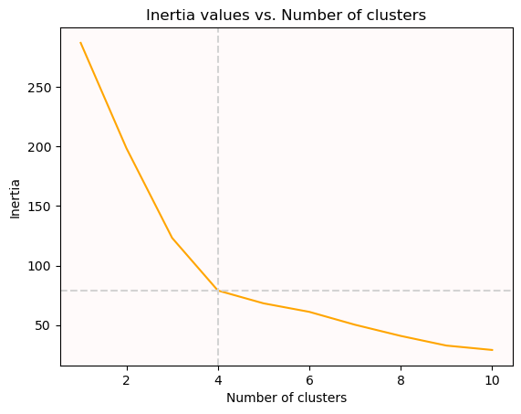

# Week_11_challenge

**In this project we examine how well the KMeans algorithim from Sklearn clusters data. After importing the necessary dependencies we perform a succint exploratory analysis:**

**Note: Abreviation to fit page price_change_percentage = ppc**

#### Data frame
"+-----------------+----------------+---------------+----------------+----------------+----------------+-----------------+---------------+\n| coin_id         |   ('ppc_24h',) |   ('ppc_7d',) |   ('ppc_14d',) |   ('ppc_30d',) |   ('ppc_60d',) |   ('ppc_200d',) |   ('ppc_1y',) |\n+=================+================+===============+================+================+================+=================+===============+\n| bitcoin         |        1.08388 |       7.60278 |        6.57509 |        7.67258 |       -3.25185 |        83.5184  |      37.5176  |\n+-----------------+----------------+---------------+----------------+----------------+----------------+-----------------+---------------+\n| ethereum        |        0.22392 |      10.3813  |        4.80849 |        0.13169 |      -12.8889  |       186.774   |     101.96    |\n+-----------------+----------------+---------------+----------------+----------------+----------------+-----------------+---------------+\n| tether          |       -0.21173 |       0.04935 |        0.0064  |       -0.04237 |        0.28037 |        -0.00542 |       0.01954 |\n+-----------------+----------------+---------------+----------------+----------------+----------------+-----------------+---------------+\n| ripple          |       -0.37819 |      -0.60926 |        2.24984 |        0.23455 |      -17.5525  |        39.5389  |     -16.6019  |\n+-----------------+----------------+---------------+----------------+----------------+----------------+-----------------+---------------+\n| bitcoin-cash    |        2.90585 |      17.0972  |       14.7533  |       15.749   |      -13.7179  |        21.6604  |      14.4938  |\n+-----------------+----------------+---------------+----------------+----------------+----------------+-----------------+---------------+\n| binancecoin     |        2.10423 |      12.8551  |        6.80688 |        0.05865 |       36.3349  |       155.619   |      69.692   |\n+-----------------+----------------+---------------+----------------+----------------+----------------+-----------------+---------------+\n| chainlink       |       -0.23935 |      20.6946  |        9.30098 |      -11.2175  |      -43.6952  |       403.229   |     325.132   |\n+-----------------+----------------+---------------+----------------+----------------+----------------+-----------------+---------------+\n| cardano         |        0.00322 |      13.993   |        5.55476 |       10.1055  |      -22.8478  |       264.514   |     156.098   |\n+-----------------+----------------+---------------+----------------+----------------+----------------+-----------------+---------------+\n| litecoin        |       -0.06341 |       6.60221 |        7.28931 |        1.21662 |      -17.2396  |        27.4992  |     -12.6641  |\n+-----------------+----------------+---------------+----------------+----------------+----------------+-----------------+---------------+\n| bitcoin-cash-sv |        0.9253  |       3.29641 |       -1.86656 |        2.88926 |      -24.8743  |         7.42562 |      93.7308  |\n+-----------------+----------------+---------------+----------------+----------------+----------------+-----------------+---------------+"

#### Features statistical metrics
"+-------+----------------+---------------+----------------+----------------+----------------+-----------------+---------------+\n|       |   ('ppc_24h',) |   ('ppc_7d',) |   ('ppc_14d',) |   ('ppc_30d',) |   ('ppc_60d',) |   ('ppc_200d',) |   ('ppc_1y',) |\n+=======+================+===============+================+================+================+=================+===============+\n| count |      41        |      41       |      41        |       41       |     41         |         41      |      41       |\n+-------+----------------+---------------+----------------+----------------+----------------+-----------------+---------------+\n| mean  |      -0.269686 |       4.49715 |       0.185787 |        1.54569 |     -0.0941185 |        236.537  |     347.668   |\n+-------+----------------+---------------+----------------+----------------+----------------+-----------------+---------------+\n| std   |       2.69479  |       6.37522 |       8.37694  |       26.3442  |     47.3658    |        435.225  |    1247.84    |\n+-------+----------------+---------------+----------------+----------------+----------------+-----------------+---------------+\n| min   |     -13.5279   |      -6.09456 |     -18.1589   |      -34.7055  |    -44.8225    |         -0.3921 |     -17.5675  |\n+-------+----------------+---------------+----------------+----------------+----------------+-----------------+---------------+\n| 25%   |      -0.60897  |       0.04726 |      -5.02662  |      -10.4385  |    -25.908     |         21.6604 |       0.40617 |\n+-------+----------------+---------------+----------------+----------------+----------------+-----------------+---------------+\n| 50%   |      -0.06341  |       3.29641 |       0.10974  |       -0.04237 |     -7.54455   |         83.9052 |      69.692   |\n+-------+----------------+---------------+----------------+----------------+----------------+-----------------+---------------+\n| 75%   |       0.61209  |       7.60278 |       5.51074  |        4.57813 |      0.65726   |        216.178  |     168.373   |\n+-------+----------------+---------------+----------------+----------------+----------------+-----------------+---------------+\n| max   |       4.84033  |      20.6946  |      24.2392   |      140.796   |    223.064     |       2227.93   |    7852.09    |\n+-------+----------------+---------------+----------------+----------------+----------------+-----------------+---------------+"
​

**Above the mean, standard deviation, count and other metrics for the data are displayed to obtain a sense of the feature range and behavior
afterwards the data is scaled to prevent the results to be skewed by one feature.

#### Scaled data

**To continue our analysis process we define a function dubbed best_k which takes in the scaled dataframe and returns another 
with the inertia values for each number of clusters examnied.

#### Inertia values data frame

#### Elbow curve visualization

